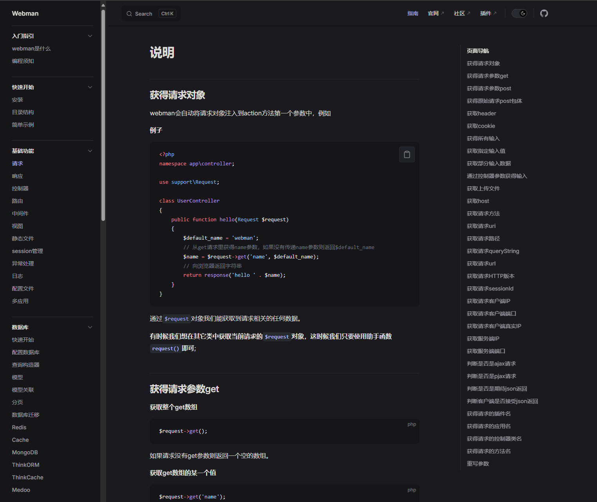

# webman 非官方文档


使用 vitepress 搭建的 webman 文档站，数据来源于官方文档站 [webman-manuanl](https://github.com/webman-php/webman-manual)

## 跟官方文档有什么不同？

- 可以切换暗黑模式
- 右侧有 TOC 导航
- 示例代码可以一键复制
- 部分代码高亮优化



## 在线使用

Demo 站： https://webman.rmb.run

## 自己部署

```shell
git clone https://github.com/ljnchn/webman-docs.git
cd webman-docs

pnpm install
pnpm run docs:dev
```
