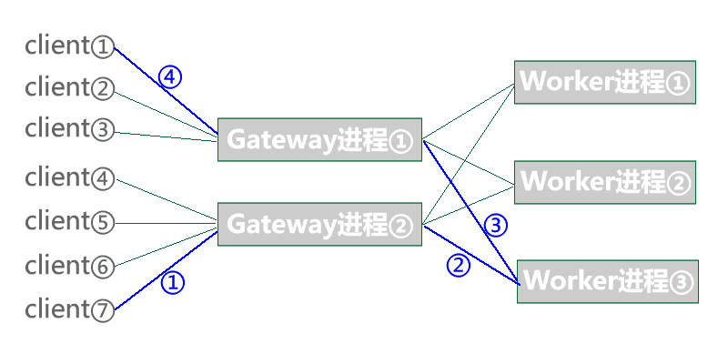

# 工作原理
1、Register、Gateway、BusinessWorker进程启动

2、Gateway、BusinessWorker进程启动后向Register服务进程发起长连接注册自己

3、Register服务收到Gateway的注册后，把所有Gateway的通讯地址保存在内存中

4、Register服务收到BusinessWorker的注册后，把内存中所有的Gateway的通讯地址发给BusinessWorker

5、BusinessWorker进程得到所有的Gateway内部通讯地址后尝试连接Gateway

6、如果运行过程中有新的Gateway服务注册到Register（一般是分布式部署加机器），则将新的Gateway内部通讯地址列表将广播给所有BusinessWorker，BusinessWorker收到后建立连接

7、如果有Gateway下线，则Register服务会收到通知，会将对应的内部通讯地址删除，然后广播新的内部通讯地址列表给所有BusinessWorker，BusinessWorker不再连接下线的Gateway

8、至此Gateway与BusinessWorker通过Register已经建立起长连接

9、客户端的事件及数据全部由Gateway转发给BusinessWorker处理，BusinessWorker默认调用Events.php中的onConnect onMessage onClose处理业务逻辑。

10、BusinessWorker的业务逻辑入口全部在Events.php中，包括onWorkerStart进程启动事件(进程事件)、onConnect连接事件(客户端事件)、onMessage消息事件（客户端事件）、onClose连接关闭事件（客户端事件）、onWorkerStop进程退出事件（进程事件）

# 适用范围

### Gateway/Worker 的进程模型

**特点：**

从图上我们可以看出Gateway负责接收客户端的连接以及连接上的数据，然后Worker接收Gateway发来的数据做处理，然后再经由Gateway把结果转发给其它客户端。每个客户端都有很多的路由到达另外一个客户端，例如client⑦与client①可以经由蓝色路径完成数据通讯

**优点：**

1、可以方便的实现客户端之间的通讯

2、Gateway与Worker之间是基于socket长连接通讯，也就是说Gateway、Worker可以部署在不同的服务器上，非常容易实现分布式部署，扩容服务器

3、Gateway进程只负责网络IO，业务实现都在Worker进程上，可以reload Worker进程，实现在不影响用户的情况下完成代码热更新。

**适用范围：**

适用于客户端与客户端需要实时通讯的项目。

