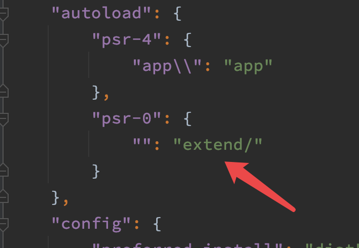

# 自动加载

## 利用composer加载PSR-0规范的文件
webman遵循`PSR-4`自动加载规范。如果你的业务需要加载`PSR-0`规范的代码库，参考以下操作。

- 新建 `extend` 目录用户存放`PSR-0`规范的代码库
- 编辑`composer.json`，在`autoload`下增加以下内容

```js
"psr-0" : {
    "": "extend/"
}
```
最终结果类似


- 执行 `composer dumpautoload`
- 执行 `php start.php restart` 重启webman (注意，必须重启才能生效) 

## 利用composer加载某些文件

- 编辑`composer.json`，在`autoload.files`下添加要加载的文件
```
"files": [
    "./support/helpers.php",
    "./app/helpers.php"
]
```

- 执行 `composer dumpautoload`
- 执行 `php start.php restart` 重启webman (注意，必须重启才能生效) 

> **提示**
> composer.json里`autoload.files`配置的文件在webman启动前就会加载。而利用框架`config/autoload.php`加载的文件是在webman启动后才加载的。
> composer.json里`autoload.files`加载的文件更改后必须restart才能生效，reload不生效。而利用框架`config/autoload.php`加载的文件支持热加载，更改后reload即可生效。


## 利用框架加载某些文件
有些文件可能不符合SPR规范，无法自动加载，我们可以通过配置`config/autoload.php`加载这些文件，例如：
```php
return [
    'files' => [
        base_path() . '/app/functions.php',
        base_path() . '/support/Request.php', 
        base_path() . '/support/Response.php',
    ]
];
```
 > **提示**
 > 我们看到`autoload.php`里设置了加载 `support/Request.php` `support/Response.php`两个文件，这是因为在`vendor/workerman/webman-framework/src/support/`下也有两个相同的文件，我们通过`autoload.php`优先加载项目根目录下的`support/Request.php` `support/Response.php`，这样允许我们可以定制这两个文件的内容而不需要修改`vendor`中的文件。如果你不需要定制它们，则可以忽略这两个配置。
